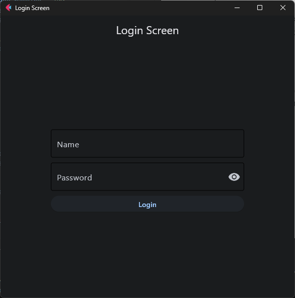
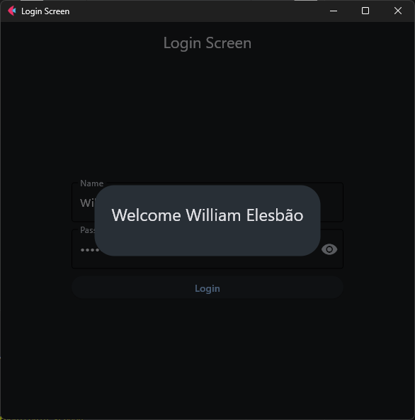

# Aplicativo de Tela de Login
Este é um aplicativo simples de tela de login construído usando o framework Flet para Python. O aplicativo fornece uma interface de login com campos para inserir um nome de usuário e senha. Ao clicar no botão "Login", verifica se ambos os campos de nome e senha não estão vazios e exibe uma mensagem de boas-vindas em um diálogo de alerta.

|  |  |  |
|---|---|---|

## Pré-requisitos
Certifique-se de ter o Python instalado no seu sistema.
###### Instale o framework Flet 
 - `pip install flet`

###### Uso
Clone o repositório.
 - `git clone https://github.com/your-username/login-screen-app.git`

###### Execute o script Python
 - `python main.py`

 A janela do aplicativo de tela de login aparecerá, permitindo que você interaja com a interface do usuário.

 
 

#### Contribuições
Sinta-se à vontade para contribuir para o projeto abrindo problemas ou enviando solicitações de pull. Seu feedback e sugestões são altamente apreciados.